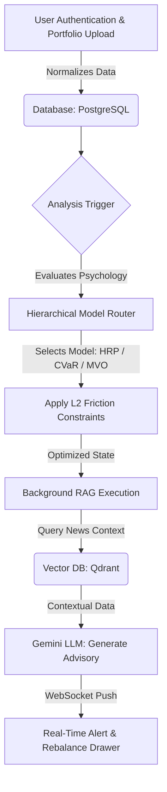

# Equisight.ai: Dynamic Portfolio Optimization and Explainable AI Advisory

## 🔴 Problem Solved

Traditional wealth management platforms frequently fail during market shocks because they rely on rigid mathematical models that ignore human emotional biases. Modern wealth-tech operates on the flawed assumption that investors are perfectly rational economic agents, yet sudden macroeconomic shocks often lead to panic-selling and abandoned strategies. Furthermore, many existing platforms utilize opaque *black-box* AI, leaving users without a clear understanding of why their portfolio weights are shifting. 

**Equisight.ai solves this** by acting as a proactive behavioral coach that balances market mathematics with investor psychology.

---

## 🔍 Existing Solutions

The current financial technology landscape is split into two compromised categories:

- **Global Robo-Advisors:** Platforms like Wealthfront and Betterment rely on static Mean-Variance Optimization (MVO) and act as *black boxes* that fail to offer dynamic psychological routing.
- **Thematic Investing Platforms:** In the Indian market, platforms like smallcase and INDmoney push thematic *smart beta* baskets but force the burden of transaction cost management onto users, risking capital drain through high-frequency trading.
- **The Quantitative Gap:** Historical failures like Motif Investing and Hedgeable proved that providing complex tools without behavioral guardrails leads directly to mass panic and excessive fees.

---

## ✅ What I Did

I developed **Equisight.ai**, a next-generation wealth-tech architecture that bridges the gap between cold mathematics and human behavior.

### Core Features:

- **Hierarchical Model Router:** Built a proprietary system that dynamically shifts between models like Hierarchical Risk Parity (HRP) for panic-prone users and Black-Litterman for advanced investors.
- **Friction-Aware Optimization:** Integrated L2 Regularization (a Ridge penalty) to penalize excessive trading and implemented a *Do Not Trade* gate that blocks execution if the Sharpe ratio improvement is negligible (<0.05).
- **Transparent RAG Pipeline:** Created an automated Retrieval-Augmented Generation (RAG) system that connects portfolio drift to live financial news, providing plain-English explanations for every recommended action.
- **Asynchronous Stack:** Architected a high-performance system using FastAPI, React 19, and Qdrant Cloud to handle real-time vector searches and live alerts.

---

## 🔄 Workflow

The platform operates through a highly synchronized five-module lifecycle:

1. **Data Ingestion:** The user drags and drops a broker statement (CSV/PDF) which is parsed into structured JSON.
2. **Behavioral Profiling:** The investor completes a 5-step wizard to capture their time horizon, drawdown tolerance, and liquidity needs.
3. **Market Analytics:** The system fetches 3 years of historical data to compute rolling volatility, max drawdowns, and portfolio beta.
4. **Psychological Routing:** Based on the user profile, the Hierarchical Router selects the most appropriate mathematical model and applies friction constraints.
5. **RAG Advisory & Alerts:** Daily drift checks trigger a semantic search of live news; recommendations are then pushed to the user via WebSockets in real-time.

---

## 🗺️ Architecture Flowchart

---

## 🚀 Key Innovations

### 1. The Hierarchical Model Router (Psychological Routing)

The platform's core innovation is a proprietary router that dynamically shifts investment strategies based on an investor's real-time psychological state.

- **Hierarchical Risk Parity (HRP):** Utilizes machine learning (agglomerative clustering) to provide robust diversification for panic-prone users.
- **Mean-CVaR:** Specifically minimizes 95th-percentile tail loss during severe market panic to prioritize capital preservation.
- **Black-Litterman Model:** Blends Bayesian priors with personal market views for advanced investors.

### 2. Explainable AI (XAI) via RAG Pipeline

Equisight.ai eradicates the *black-box* nature of AI by connecting portfolio changes to live world events.

- **Semantic Search:** Ingests live financial RSS feeds (e.g., LiveMint, NDTV Profit) into a Qdrant Cloud vector database.
- **Plain-English Counsel:** Uses Gemini 3.1-flash-lite to synthesize market data with news context, providing transparent, empathetic reasoning for every recommendation.

### 3. Institutional-Grade Friction Guardrails

The system protects retail capital from the *hidden drain* of over-trading.

- **L2 Regularization (Ridge Penalty):** Mathematically penalizes excessive weight shifts to enforce portfolio sparsity and reduce brokerage fees.
- **Do Not Trade (DNT) Gate:** Physically blocks execution if the projected Sharpe ratio improvement is less than 0.05.
- **Transaction Cost Scoring:** Automatically deducts 20% from rebalance scores for smaller portfolios (under ₹1,00,000) to ensure trade viability.

---

## 🛠️ Tech Stack

- **Backend:** FastAPI, PostgreSQL
- **Frontend:** React 19
- **Vector Database:** Qdrant Cloud
- **LLM:** Google Gemini 3.1-flash-lite
- **Real-Time Communication:** WebSockets

---

## 📄 License

This project is licensed under the MIT License - see the LICENSE file for details.

---

## 👤 Author

**Jahanvi Gupta** - [GitHub](https://github.com/JahanviGupta17)

---

*Equisight.ai: Where Math Meets Mind in Wealth Management*
